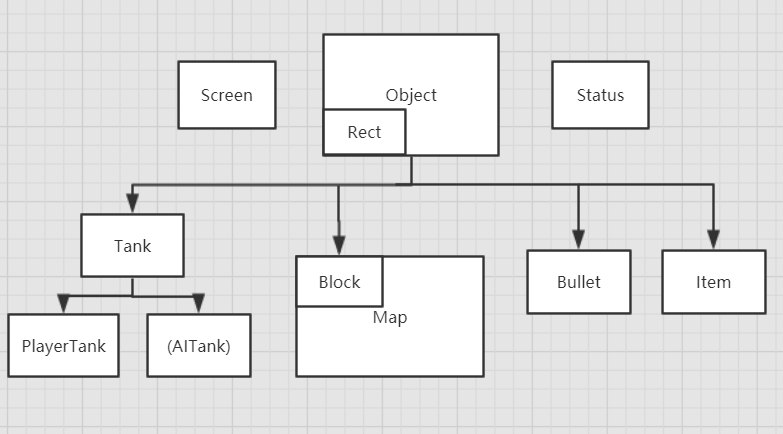

<center>
    <font face="仿宋" size=23>
        小学期自主选题设计说明书
    </font>
</center>
<div style="text-align: right"> 
    <font size=3.5 face="华文楷体" >
    无82 李煜泽 2018011060
    </font>
</div>

# Tank Battle

## 简单的使用说明

- 在[../Game](../Game)文件夹中, 有游戏的`.exe`文件和一个叫做 _tank-color.txt_ 的用来自定义坦克颜色的文件, 其中内容如下:
	```txt
	25 202 173 224 96 108
	// 该文件中应该含有6个0-255的数字, 数字间用空格隔开, 依次代表玩家1和玩家2的坦克的RGB颜色
    // 你应该按照文件中已有的格式填写
    // 任何非法的文件内容都会导致自定义颜色失败, 使用默认配色	
	```
	你可以按照上述方式来进行配置
- 进入游戏后, 按回车键开始本地的双人对战, 玩家1的操控方式是使用键盘的`WASD`键移动, `J`键射击<br/>玩家2的操控方式是使用方向键移动, 小键盘`0`键射击
- 游戏过程中, 可以随时按下`Q`键来退出, 此时系统将判定血量较多的玩家获胜
- 游戏中时间以帧为单位进行, 一秒中大约有15帧左右
- 每过150帧(也就是说, 大约10秒)地图上会刷新出一个道具, 道具有五种可能的产生位置, 分别在地图的四角的和正中央. 新的道具刷新时旧的道具会消失, 也就是说场上只会存在一个道具. 道具的剩余刷新帧数在右侧的状态栏会显示, 其下方说明了不同道具的效果
- 玩家的初始生命值为10, 速度为5, 子弹威力为1, 冷却为15帧
  数值成长上限为生命值15, 速度13, 子弹威力3, 冷却4帧
- 游戏结束后按回车键退出

## 设计思路简述

- 这个程序的结构与开题报告中几乎相同, 主要区别是没有实现在报告中写的局域网对战的功能(由于对数据传输延迟的要求较高), 而是通过加入了道具的设定对整体的游戏性和竞技性进行了提升
- 这个程序完全由C++编写, 图形界面使用了[easyx](https://easyx.cn/)库, 自主编写了简单的基于矩形来判断碰撞的物理引擎
- 游戏中所有的碰撞判断基于物体的矩形物理模型, 判断的操作在`Rect`类中实现, 它作为物体的物理模型是所有物体都有的一个属性
- 整个程序除了文件读取操作以外的内容有90%都是面向对象的, 游戏中几乎所有类(除了静态的屏幕类和统计数据类)都是基于一个名为`Object`的抽象类派生而来的
- 程序中函数命名采用大驼峰法, 变量命名用 _ 来连接单词, 编码方式为UTF-8. 程序中仍留有开发人机对战和在线对战的接口

## 程序结构介绍

如上所述, 程序中几乎所有类都是基于一个名为`Object`的抽象类派生来的, 在此给出各个类的声明并且作简要介绍

各个类的继承关系如下



### Object

包含了所有物体一定拥有的属性和方法的抽象类
```c++
//can be everything
class Object 
{
public:
	virtual void Display() = 0;
	virtual bool IsExist() = 0;
	virtual void CalPhysicalSize() = 0;
	virtual void Destory() = 0;

	Rect physical_size;
protected:
	COLORREF color;
	DIR dir = UP;
	Point pos;
	bool existing = true;
}; 

```

### Rect

矩形类, 用于物理碰撞的判断, 利用左上角和右下角的两个点来记录, 其中重载了运算符`==`来方便方法的调用

```c++
class Rect
{
public:
	Rect(Point = { 0,0 }, Point = { 0,0 });

	void SetStartPoint(Point);
	void SetEndPoint(Point);

	bool PointInRect(Point);
	bool CollisionCheck(Rect&);
	bool operator ==(Rect&);

	Point GetStartPoint();
	Point GetEndPoint();
protected:
	Point start_point, end_point;
};
```

### Tank

Tank类继承了Object, PlayerTank继承了Tank(此处给AITank留了接口), Tank中包含了一些坦克特有的属性和方法, PlayerTank中主要含有一些面向玩家操作的方法和实现

```c++
//May have a AITank
class Tank:public Object
{
	friend class Item;
	friend class Status;
public:
	virtual void Move(DIR) = 0;
	virtual void Shoot(std::list<Bullet*>&) = 0;
	virtual void CoolDown() = 0;
protected:
	int hp;
	int speed;
	int cool_down_limit;
	int shoot_cool_down;
	int super_shoot;
	int bullet_power;
};

class PlayerTank:public Tank
{
public:
	PlayerTank();

	void SetDir(DIR);

	//for initialization
	void SetColor(COLORREF);
	void SetPosition(int, int);

	virtual void Display();
	virtual void Move(DIR);
	virtual void Shoot(std::list<Bullet*>&);
	virtual void CoolDown();
	virtual void Destory();
	void DestoryByDamage(int);

	virtual void CalPhysicalSize();

	virtual bool IsExist();

	bool MoveCheck(DIR);

protected:
	void DrawTank(DIR);
};
```

### Bullet

子弹类, 继承Object, 由坦克调用射击方法创建, 额外有速度和伤害属性, 作为Tank的友元类方便命中时的操作

```c++
class Bullet :public Object
{
public:
	Bullet(Point, DIR, COLORREF, int);

	void Display();
	void Move();
	bool IsExist();
	void Destory();
	void CalPhysicalSize();
	int GetDamage();

protected:
	int speed;
	int damage;
};
```

### Item

道具类, 继承Object, 有生成随机位置和效果的方法, 通过调用部署和激活两个方法来使用

```c++
class Item :public Object
{
public:
	void Deploy();
	void SetRandomPos();
	void SetRandomFunc();
	void Activate(PlayerTank&);

	virtual void Display();
	virtual bool IsExist();
	virtual void CalPhysicalSize();
	virtual void Destory();
protected:
	Func func;
};
```

### Map

Map本身只含有静态方法(因为只有一张地图), 在调用`Create`方法时会按照预设创建一些Block对象, 放入需要判断物理碰撞的链表中, 然后每帧调用显示方法<br/>Block继承Object

```c++
class Block :public Object
{
public:
	Block();
	Block(COLORREF,Point,Point);
	virtual void Display();
	virtual bool IsExist();
	virtual void CalPhysicalSize();
	virtual void Destory();

	void SetPosition(Point, Point);
	void SetColor(COLORREF);
};

class Map
{
public:
	static void Create(Block*);
	static void Display(Block*);
};
```
## 源代码
代码在[Source](../Source)文件夹中<br/>
由于文件过多在此不作展示
您也可以在[github](https://github.com/zxdclyz/TankBattle)查看代码和体验游戏
## 总结与反思

我认为这次的大作业作为学习了面向对象编程之后的总结还是很不错的, 在这个程序中我几乎把本学期学的东西都用了一下. 当然还是有一些遗憾的地方的, 比如因为时间原因没有加入联网对战和人机对战功能, 但是还好程序整体的可扩展性很强. 还有游戏运行中会出现屏闪的问题, 这是使用的界面`easyx`造成的, 因为它本身只是一个绘图工具, 所以现在的画面是在不停地刷新, 所以有时候刷新速度不稳定会造成屏闪. 其实本来是想选用`cscos2d`或者`unity`来做的, 这样花在底层的属性设置和构建物理引擎的时间会大大减少, 或许能给游戏加入更多的内容, 再或者直接用`python`和`pygame`来做, 虽然画面效果不会好太多, 但是工作量会大大减少. 但是考虑到这是程设课的作业, 我还是选用了`C++`来完成, 尽管效果并不令人满足, 也算是对课程的一个总结吧, 以后用`C++`写面向对象的机会可能不会太多了. 